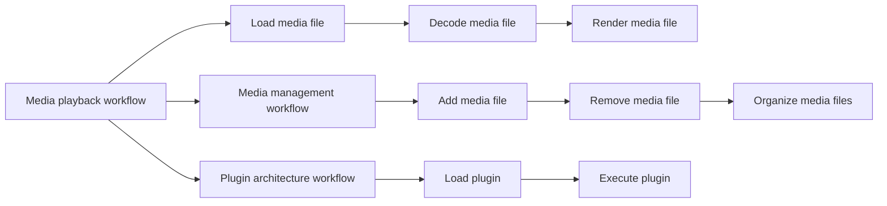

**VLC Project Business Requirements Document**
==============================================

## 1. Executive Summary
The VLC project aims to analyze and document the business requirements for the VLC media player software. The project involves reviewing the existing codebase, identifying key stakeholders, and defining the functional and non-functional requirements. The goal is to provide a comprehensive business requirements document that can guide the development and maintenance of the VLC media player.

## 2. Business Objectives and Goals
The business objectives and goals of the VLC project are:

* To improve the overall quality and maintainability of the VLC media player codebase
* To identify and document the key features and functionalities of the VLC media player
* To provide a clear understanding of the stakeholder needs and expectations
* To ensure compliance with industry standards and best practices

The specific goals of the project are:

* To analyze the existing codebase and identify areas for improvement
* To define a clear and comprehensive set of functional and non-functional requirements
* To develop a robust and scalable architecture for the VLC media player

## 3. Stakeholder Analysis
The stakeholders for the VLC project include:

* **End-users**: Individuals who use the VLC media player for personal or professional purposes
* **Developers**: Individuals responsible for developing and maintaining the VLC media player codebase
* **Contributors**: Individuals who contribute to the VLC media player project through bug reports, feature requests, or code contributions
* **VLC Team**: The team responsible for managing and maintaining the VLC media player project

The stakeholder needs and expectations are:

* End-users: Easy to use, fast, and reliable media player with a wide range of features
* Developers: Maintainable, scalable, and well-documented codebase
* Contributors: Clear and transparent contribution process
* VLC Team: High-quality software that meets user needs and expectations

## 4. Functional Requirements
The functional requirements for the VLC project are:

* **Media playback**: Play various types of media files (audio, video, etc.)
* **Media management**: Manage media files, including adding, removing, and organizing files
* **Playback controls**: Provide playback controls, such as play, pause, stop, and seek
* **Audio and video settings**: Allow users to adjust audio and video settings, such as volume, brightness, and contrast
* **Subtitle support**: Support for subtitles and closed captions
* **Plugin architecture**: Support for plugins and extensions

The functional requirements are further detailed in the following table:

| Requirement | Description |
| --- | --- |
| FR-1 | Play various types of media files |
| FR-2 | Manage media files |
| FR-3 | Provide playback controls |
| FR-4 | Allow users to adjust audio and video settings |
| FR-5 | Support subtitles and closed captions |
| FR-6 | Support plugins and extensions |

## 5. Non-Functional Requirements
The non-functional requirements for the VLC project are:

* **Performance**: Fast and responsive media playback
* **Security**: Secure media playback and data storage
* **Usability**: Easy to use and intuitive user interface
* **Scalability**: Scalable architecture to support large user base
* **Maintainability**: Maintainable and well-documented codebase

The non-functional requirements are further detailed in the following table:

| Requirement | Description |
| --- | --- |
| NFR-1 | Fast and responsive media playback |
| NFR-2 | Secure media playback and data storage |
| NFR-3 | Easy to use and intuitive user interface |
| NFR-4 | Scalable architecture |
| NFR-5 | Maintainable and well-documented codebase |

## 6. Business Processes and Workflows
The business processes and workflows for the VLC project include:

* **Media playback workflow**: The workflow for playing media files, including loading media files, decoding, and rendering
* **Media management workflow**: The workflow for managing media files, including adding, removing, and organizing files
* **Plugin architecture workflow**: The workflow for loading and executing plugins and extensions

The business processes and workflows are further detailed in the following diagram:

## 7. Success Criteria and KPIs
The success criteria and KPIs for the VLC project are:

* **Success criteria**:
	+ The VLC media player meets the functional and non-functional requirements
	+ The VLC media player is stable and reliable
	+ The VLC media player is easy to use and intuitive
* **KPIs**:
	+ User engagement metrics (e.g., time spent using the media player, number of media files played)
	+ User satisfaction metrics (e.g., survey responses, user reviews)
	+ Technical metrics (e.g., performance benchmarks, crash rates)

## 8. Risk Assessment and Mitigation
The risk assessment and mitigation strategies for the VLC project are:

* **Risk 1: Technical debt**: The risk that the codebase may become outdated and difficult to maintain
	+ Mitigation strategy: Regular code reviews and refactoring
* **Risk 2: Security vulnerabilities**: The risk that the media player may be vulnerable to security threats
	+ Mitigation strategy: Regular security audits and patching
* **Risk 3: User adoption**: The risk that the media player may not meet user needs and expectations
	+ Mitigation strategy: User research and testing

## 9. Timeline and Milestones
The timeline and milestones for the VLC project are:

* **Milestone 1: Code analysis and documentation** (Due: 2023-02-15)
* **Milestone 2: Requirements gathering and documentation** (Due: 2023-03-01)
* **Milestone 3: Design and architecture** (Due: 2023-03-15)
* **Milestone 4: Implementation and testing** (Due: 2023-04-15)
* **Milestone 5: Deployment and maintenance** (Due: 2023-05-01)

The project timeline is approximately 20 weeks. The project will be completed in the following phases:

* **Phase 1: Planning and analysis** (Weeks 1-4)
* **Phase 2: Design and architecture** (Weeks 5-8)
* **Phase 3: Implementation and testing** (Weeks 9-16)
* **Phase 4: Deployment and maintenance** (Weeks 17-20)